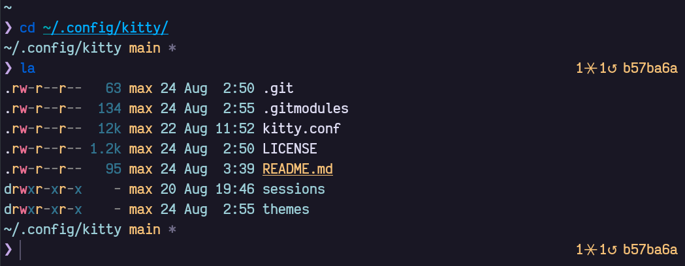

# dotfiles-kitty

Configuration files for [kitty](https://sw.kovidgoyal.net/kitty/index.html).

<div align="center">
  
</div>

- screenshot theme: `themes/`[rose-pine.conf](https://github.com/rose-pine/kitty)
- [fish](https://fishshell.com/) shell
  - my configuration files for [it](https://github.com/maxdevjs/dotfiles-fish)  
- `la` aliased to [exa](https://the.exa.website/) `-al`

## How to install it

When using [yadm](https://yadm.io/), add this repo as `submodule`. The general recipe is:

> NOTE: this specific command `MUST` be issued in `$HOME`

```yaml
~ $ yadm submodule add <url> path
~ $ yadm submodule update --init --recursive
```

In this specific case:

```yaml
~ $ yadm submodule add https://github.com/maxdevjs/dotfiles-kitty .config/kitty
~ $ yadm submodule update --init --recursive
```
